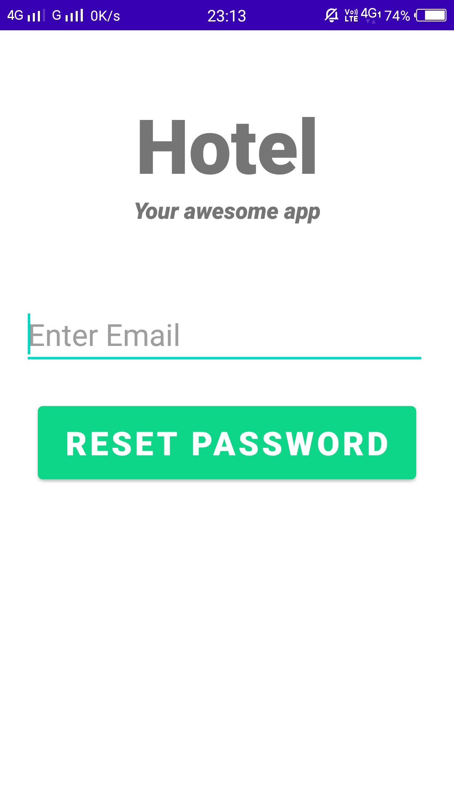

# smartHotel
An Android application that lets user to have access of their booked hotel room and allow them to lock/unlock their main door using raspberry pi (Only Android files here)

## Objective
To create a mobile application that enables the user to lock/unlock their booked hotel rooms just by a single click.

## Technology Stack
1. Android Studio
2. Java
3. Firebase

## Major Functionalities
1. Registration and Login
   1. Register
   2. Login
   3. Forgot Password
   4. Email Authentication
2. Home Page
   1. List of Hotels in the App
      1. Select the hotel of your choice and book it.
3. My Account
   1. User's basic Details are displayed here.
4. My Bookings
   1. User's booked Hotels are Displayed here
   2. Here, the user can lock/unlock the door using a simple button.

## Images

